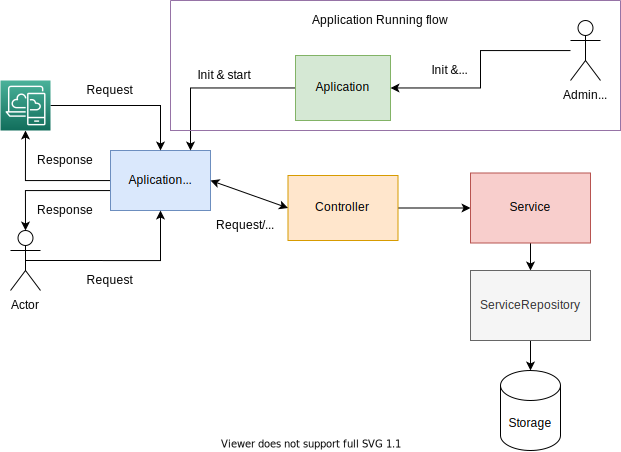

# Namla microservice interview

A proposed implementation of a  microservice to serve suppliers and orders data over an HTTP REST API.

## Tracking the application progress

To track the progress of this project, I set up a simple agile(scrum) dashboard on Azure DevOps  on this link [Azure DevOps](https://dev.azure.com/samyouaret13/namla-interview).

## Running the application

For a quick setup, the application can be built and run with **Docker** and `docker-compose`, building the application image.

    docker build -t order-service .

Running the application

    docker run -dp 3000:3000 order-service

To run the it with docker-compose

    docker-compose up -d

to shut down the application just run

    docker-compose down

If constantly pulling change from this repository remember to re-build your image by running 

    docker-compose build 
    
So you can avoid stale builds, Then you can run

    docker-compose up -d

### Application endpoints

The application should be server on port `3000` where the host in local is  [localhost:3000](`http://localhost:3000`)

All Endpoints are served with the prefix `/api/`, There are four endpoints:

1. Get all suppliers `/api/suppliers`.
2. Get a supplier by id `/api/suppliers/<id:int>`.
3. Get all orders `/api/orders`.
4. Get an order by id `/api/orders/<id:int>`.

## Application structure

While making it work is good, making it maintainable and testable is more important. The application structure is a layered architecture with respect to the **SOLID** principles.

Each layer serves a specific purpose, the ultimate goal is the make each layer replaceable and testable on its own without the need for setting up the application.

Testability for just enough purpose is maintained in the application architectures, Built-in quality is a must, it is not a luxury. 

In summary, this application should allow us at least to do the following steps without breaking down the application.

1. We can Test all parts in isolation.
2. Any Part(usually a layer) should be replaceable.
3. we should not struggle with refactoring.
4. Databases, and HTTP servers are just details.

Regrading the fourth(4) point the goal is the delay decisions 
about HTTP servers, databases choices, they should be pluggable into our architecture, not a dependency.

We talked too much so far, the picture below represents the application structure.

Describing the Application architecture, we can see the HTTP server acts just as a **Gateway** for our application, it is not a dependency by itself, Actionly it was the last thing to implement and add the end-to-end testing for the endpoints.

Controllers interact with Application Gateway(HTTP server), and **service**, it uses services to serve those requests.
Services hold the business logic, although our application has only a few concerns at the moment all business logic should happen in services.

**Repositories** Acts as the **gateway** to access data, it uses Stores(it could be a database as well as it could a file system or in-memory data), Datastore should be replaceable.

To keep dependency as low as possible, the dependency injection follows one direction from Top to down, Contracts(interface) should be set the boundaries and relationships between each layer.

Back to the root application, it is the starting point to run the application, it manages an **Application gateway** which in our case is the HTTP server.

As a concrete example of an HTTP server, we are using **expressjs**.

## Development Part

If you want to get your hand dirty, you can start by cloning this repository

    git clone https://github.com/samyouaret/namla-microservice-interview.git

you can use the same instructions as in the Running the application section or install `nodejs` and yarn (recommended) and you are ready to go.

To run tests

    yarn run test

You can run only units tests

    yarn run test:unit

The same could be applied to run E2E tests

    yarn run test:e2e
